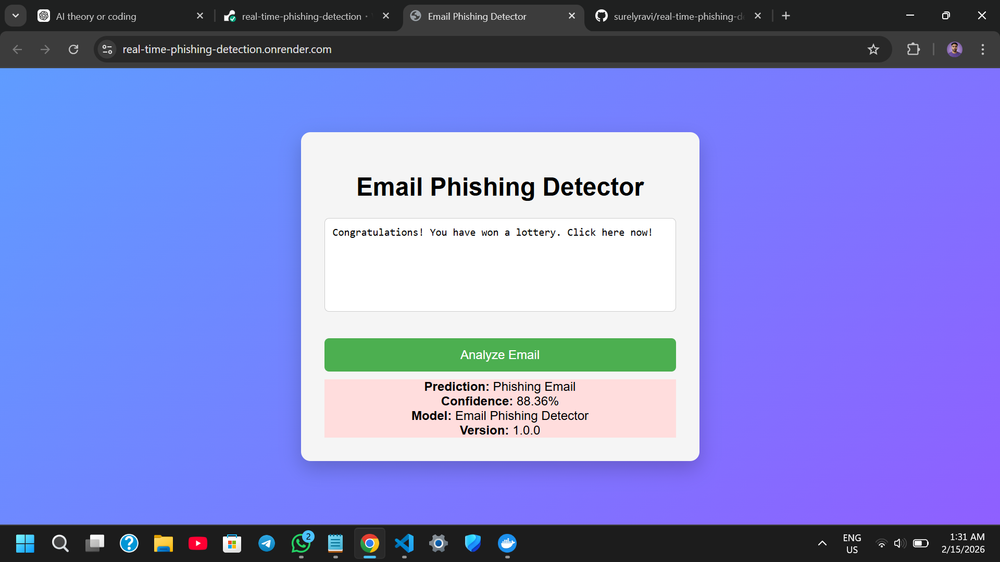

# Real-Time Phishing Detection System

A machine learning-based real-time email phishing detection system built using FastAPI and an interactive frontend.

---

## 🌐 Live Demo

🔗 https://real-time-phishing-detection.onrender.com

## 📄 API Documentation (Swagger)

🔗 https://real-time-phishing-detection.onrender.com/docs

---

## 📸 Application Screenshot



---


## 🚀 Features
- Real-time phishing email classification
- TF-IDF vectorization
- Trained ML model (.pkl)
- FastAPI backend
- Interactive frontend
- Docker support


## 📊 Model Performance

The model was trained using TF-IDF vectorization with Logistic Regression classifier.

- **Accuracy:** 98%
- **Dataset Size:** 16,498 emails
- **Evaluation Metrics:**
  - Precision: 0.98
  - Recall: 0.98
  - F1-Score: 0.98

The model demonstrates strong performance in detecting phishing emails while maintaining high precision and recall.


## 🛠 Tech Stack
- Python
- Scikit-learn
- FastAPI
- HTML/CSS/JavaScript
- Docker


## 🏗 Project Structure
```
api/        # FastAPI backend
frontend/   # HTML, CSS, JS interface
models/     # Trained ML models
notebooks/  # Model training notebook
```


### Requirements
- Python 3.10+


## ⚙️ Installation

1. Clone the repository:

```bash
git clone https://github.com/surelyravi/real-time-phishing-detection.git
cd real-time-phishing-detection
```

2. Create and activate a virtual environment:

```bash
python -m venv venv
```

Activate the virtual environment:
On Windows:
```bash
venv\Scripts\activate
```

On macOS/Linux:
```bash
source venv/bin/activate
```


3. Install dependencies:

```bash
pip install -r requirements.txt
```


4. Run the server:
```bash
uvicorn api.main:app --reload
```


5. Open in your browser:

```bash
http://127.0.0.1:8000
```


## 📌 Note
Large dataset file is excluded from the repository.


